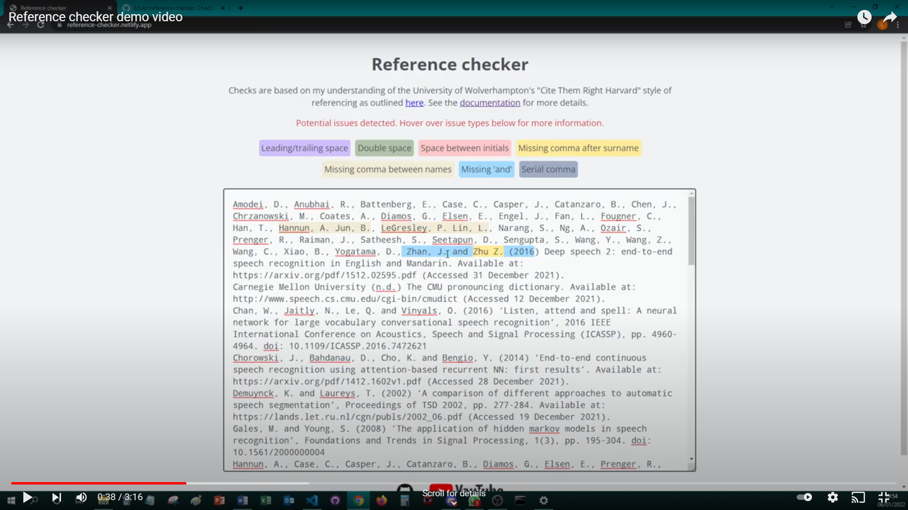

# Reference checker

## How to use it

Go to https://reference-checker.netlify.app/.

Paste your list of references into the text area displayed and read the advice displayed. Hover your mouse over any potential errors for more details.

If there are any potential errors, you are recommended to make any necessary changes in the file containing your essay and paste the references into the tool again after editing to confirm that all necessary changes have been made correctly. There may of course be 'false positives' which can be ignored just like for any proofing tool.

See below for the full list of checks.

<a href="https://youtu.be/UFPMFIrCqaw">Demo video:</a>

<a href="https://youtu.be/UFPMFIrCqaw"></img></a>

## List of checks

<table><tr><th>Check</th><th>Description</th><th>Regular expression</th></tr><tr><td>Leading/trailing space</td><td>You may have some spaces at the start or end of lines. Consider removing.</td><td><code>/^ |\n | \n| $/gm</code></td></tr><tr><td>Double space</td><td>You may have some double spaces in your reference list. Consider removing.</td><td><code>/  +/g</code></td></tr><tr><td>Space between initials</td><td>Quick Start Guide available on University website has names with more than one initial with no spaces between initials (e.g. Perkin, G.D.).</td><td><code>/\w\.\s+\w\./g</code></td></tr><tr><td>Missing comma after surname</td><td>A comma is required after each surname before the initials (e.g. Watt, I.S.)</td><td><code>/\b\w+\s([A-Z]\.)+/g</code></td></tr><tr><td>Missing comma between names</td><td>A comma is required between names in lists of 3 or more authors, expect before the 'and' (e.g. (e.g. Ratnawati, V., Freddy, D. and Hardi, H.)</td><td><code>/\w+, (\w\.)+ \w+, (\w\.)+/g</code></td></tr><tr><td>Missing 'and'</td><td>Quick Start Guide available on University website has 'and' before the last name in lists of names (e.g. Ratnawati, V., Freddy, D. and Hardi, H.)</td><td><code>/(?&lt;!and) \S+,[^\n,]*\(\d{4}/g</code></td></tr><tr><td>Serial comma</td><td>Quick Start Guide available on University website has lists of three or more names without serial commas (e.g. Ratnawati, V., Freddy, D. and Hardi, H.).</td><td><code>/,\s?and/g</code></td></tr><tr><td>Capitalised 'doi'</td><td>Quick Start Guide available on University website has 'doi' in lowercase</td><td><code>/DOI|Doi/g</code></td></tr><tr><td>Full stop after doi</td><td>Quick Start Guide available on University website has no full stop at the end of lines ending with a DOI</td><td><code>/doi: \S*\.(?!\d)/g</code></td></tr><tr><td>Et al.</td><td>'Et al.' belongs in in-text citations. Authors should be listed in full in the list of references.</td><td><code>/[Ee][Tt] [Aa][Ll]/g</code></td></tr></table>

## Credits

Text area highlights implemented using [highlight-within-textarea](https://github.com/lonekorean/highlight-within-textarea) plugin.

Hover tooltips implemented based on [W3Schools tutorial](https://www.w3schools.com/css/css_tooltip.asp).